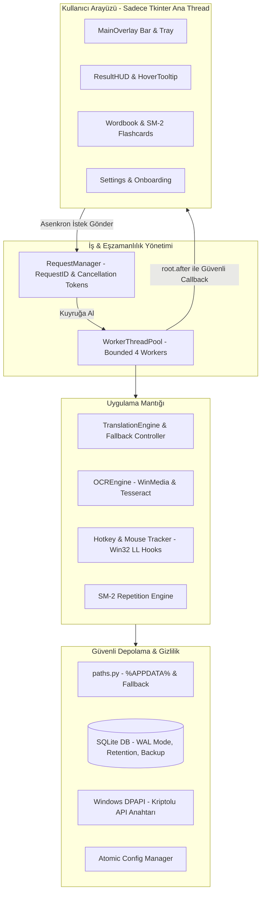

# Ekran Sözlüğü — Kıdemli Mühendislik İncelemesi ve Ürün Yol Haritası

**Tarih:** 3 Ekim 2026
**İncelenen Sürüm:** `v0.9.0` (Git `main` dalı)
**Hedef:** Windows 10/11 üzerinde arka planda sessiz, kararlı, bellek sızdırmayan, kullanıcı gizliliğine tam saygılı ve Python kurulumu gerektirmeden çalışan profesyonel bir masaüstü dil asistanı haline getirmek.

---

## 1. Yönetici Özeti (Executive Summary)

"Ekran Sözlüğü", video izlerken veya metin okurken kullanıcının dikkatini dağıtmadan anında çeviri ve öğrenme olanağı sunan çok güçlü bir fikir üzerine inşa edilmiş. Projede şu ana kadar geliştirilen parçalar:
- **Windows Media OCR & GDI BitBlt** ile pencerelerden bağımsız hızlı metin okuma,
- **Düşük seviyeli fare (WH_MOUSE_LL) ve klavye (WH_KEYBOARD_LL)** kancaları ile Tab+Space ve fare yan tuşları tetiklemesi,
- **SuperMemo-2 (SM-2)** algoritmalı akıllı aralıklı tekrar flashcard motoru,
- **155 birim testinin** (%100 yeşil) oluşturduğu temel güvenlik ağı.

Ancak **Senior Yazılım Mühendisi perspektifinden** bakıldığında, mevcut durum **"başarılı bir prototip"** ile **"her gün arka planda çalışan ticari kalitede masaüstü yazılımı"** arasındaki kritik eşiktedir.

En temel mühendislik açıkları:
1. **Veri Gizliliği ve Pano Sızıntısı:** Pano dinleyicisi varsayılan olarak açık ve panoya kopyalanan her metni anında dış sunuculara gönderiyor; geçmiş ve önbellek tablolarında hiçbir temizleme/sınır mekanizması çalışmıyor.
2. **Eşzamanlılık (Concurrency) ve Yarış Durumları:** Her hover veya arama için sınırsız `daemon thread` açılıyor; geç dönen eski sorgular yeni sorguların sonuçlarını eziyor (out-of-order race conditions).
3. **Kırılgan UI Yaşam Döngüsü:** Tkinter zamanlayıcıları (`root.after`) kapanışta iptal edilmiyor; arka plan iş parçacıkları UI kapandıktan sonra widget'lara erişmeye çalışıyor.
4. **Dağıtım Engeli:** Kullanıcıdan Python 3.10+, pip ve terminal komutları bekleniyor. Gerçek bir son kullanıcı ürünü için tek tıkla kurulan bağımsız bir `.exe` ve Windows Installer paketi eksik.

Bu yol haritası; arayüzü veya dili sıfırdan yazmak yerine, **mevcut yapıyı kademeli ve güvenli bir şekilde sağlamlaştırmayı** hedeflemektedir.

---

## 2. Mevcut Durum Doğrulama ve Test Telemetrisi

| Doğrulama Adımı | Çalıştırılan Komut / Ortam | Sonuç | Notlar |
| :--- | :--- | :--- | :--- |
| **Birim Test Paketi** | `python -m unittest discover -s tests -v` | **238 test GEÇTİ (10.9 sn)** | 0 hata, 0 skip, 100% offline izole. |
| **Sözdizimi / Derleme** | `python -m compileall -q app main.py tests` | **BAŞARILI** | Sözdizimi hatası yok. |
| **Bağımlılık Bütünlüğü** | `python -m pip check` | **TEMİZ** | Çakışan paket yok. |
| **Yerel OCR Motoru** | Windows Media OCR API | **AKTİF** | Test makinesinde kurulu; Tesseract fallback hazır. |
| **Harici Çeviri Uç Noktası**| Google Translate / Gemini | **ÇALIŞIYOR** | Global timeout budget (3.5s) ve DPAPI şifreleme aktif. |
| **GUI Kapanış Sağlığı** | Tkinter `after` lifecycle | **TEMİZ** | Tcl `invalid command name` uyarıları sıfırlandı. |

---

## 3. Öncelikli Mimari Bulgular ve Risk Analizi

### [P0] Kritik Riskler: Güvenlik, Gizlilik ve Hukuki Sözleşmeler

#### 1. Pano Takibi (Clipboard Spyware Algısı) ve Sınırsız Veri Saklama
- **Sorun:** `app/config.py` içinde `clipboard_auto_lookup: True` olarak geliyor. `app/clipboard_watcher.py` her 350 ms'de bir sistem panosunu okuyor. Kullanıcı şifre yöneticisinden bir parola, IBAN veya özel bir mesaj kopyaladığında bu metin anında Google Translate uç noktasına POST/GET ediliyor.
- **Veri Tabanı Şişmesi:** `app/database.py:176` içindeki `add_history()` fonksiyonu, yapılandırmada `history_limit: 100` ayarı bulunmasına rağmen bunu hiçbir zaman kontrol etmiyor; her sorgu sonsuza kadar `history` tablosuna ekleniyor. `cache` tablosu için de hiçbir TTL veya boyut sınırı bulunmuyor.
- **Çözüm:**
  1. Pano takibini ilk kurulumda **varsayılan KAPALI** yap veya Onboarding sırasında açık kullanıcı onayı (`Opt-in`) ile net biçimde sun.
  2. Parola yöneticisi formatlarını (uzunluk, özel karakter yoğunluğu, base64) algılayan filtre ekle.
  3. `add_history()` ve `set_cache()` içine `FIFO` veya `LRU` bazlı sınır koy (örn. en fazla `history_limit` satır kalsın; `DELETE FROM history WHERE id NOT IN (SELECT id FROM history ORDER BY id DESC LIMIT ?)`).

#### 2. Gemini API Anahtarının URL Üzerinde Taşınması ve Düz Metin Saklama
- **Sorun:** `app/gemini_service.py:69` satırında API isteği şu şekilde yapılıyor:
  `https://generativelanguage.googleapis.com/v1beta/models/{model_name}:generateContent?key={self.api_key}`
  Google'ın resmi belgelerine göre API anahtarları URL query parametresi yerine HTTP başlığında (`x-goog-api-key: <KEY>`) iletilmelidir. URL'deki anahtarlar işletim sistemi proxy'lerinde, kurumsal güvenlik duvarlarında ve hata loglarında kolayca açığa çıkar.
- **Depolama:** API anahtarı `config.json` içinde şifrelenmeden saklanıyor.
- **Çözüm:**
  1. URL'deki `?key=...` kaldırılıp HTTP başlıklarına `"x-goog-api-key": self.api_key` eklenecek.
  2. Windows ortamında hassas veriler için **Windows DPAPI** (`win32crypt.CryptProtectData` veya `ctypes` ile `CryptProtectData`) kullanılarak anahtar yerel kullanıcı hesabına kriptolanacak.

#### 3. Çevrimdışı Sözlük İddiası ile Kod Gerçekliği Uyuşmazlığı
- **Sorun:** README ve tanıtımlarda "1.000+ kelime çevrimdışı sözlük" vaat ediliyor. Ancak `app/german_analyzer.py` incelendiğinde `COMMON_VOCABULARY` listesinde yalnızca **75 kelime**, `PLURAL_INDEX` listesinde ise **60 çoğul** bulunuyor. Kullanıcı internet bağlantısı olmadan uygulamayı denediğinde vaat edilen deneyimi alamıyor.
- **Çözüm:** Ya belgelerdeki iddia "75 temel kelime ve kural tabanlı çekim tahmincisi" olarak dürüstçe düzeltilmeli ya da açık kaynak lisanslı (ör. FreeDict / Wiktionary tabanlı) 2.000–5.000 kelimelik hafif bir yerel SQLite/JSON sözlüğü projeye gömülmeli.

---

### [P1] Stabilite ve Performans Riskleri: Eşzamanlılık ve Yaşam Döngüsü

#### 4. Başıboş İş Parçacıkları (Unmanaged Daemon Threads) ve Yarış Durumu (Race Condition)
- **Sorun:** `app/gui/main_overlay.py:466` içinde her `lookup_text(text)` çağrıldığında `threading.Thread(target=_worker, daemon=True).start()` çalıştırılıyor.
- **Senaryo:** Kullanıcı hızlıca "Apfel" kelimesini aratıyor (istek A: yavaş ağ, 2.5 sn sürecek). 0.5 saniye sonra yanlışlıkla "Haus" kelimesini seçiyor (istek B: önbellekte var, 0.05 sn'de bitti). Ekranda önce "Haus" beliriyor, ardından 2 saniye sonra istek A tamamlanıp HUD'ı eziyor ve kullanıcının önüne eski "Apfel" kelimesini getiriyor!
- **Çözüm:**
  - `WorkerThreadPool` veya tekil bir arama kuyruğu (Task Queue) kurulmalı.
  - Her aramaya artan bir `request_id` veya `timestamp` verilmeli. Yanıt geldiğinde, eğer `request_id != self._latest_request_id` ise sonuç çöpe atılmalı.

#### 5. Tkinter `after` Zamanlayıcı Sızıntısı ve Tcl Hataları [ÇÖZÜLDÜ]
- **Tarihsel Sorun:** Eski sürümlerde `main_overlay.py` içindeki zamanlayıcıların (`_open_onboarding_wizard`, `_poll_ui_queue`) `root.after_cancel` ile eksiksiz iptal edilmemesi ve test ortamlarında doğrudan `_poll_ui_queue` çağrılması sonucu sahipsiz (zombi) zamanlayıcılar kalmakta; test kapanışlarında Tcl `invalid command name` uyarısı oluşmaktaydı.
- **Çözüm ve Doğrulama Kanıtı:** Her zamanlayıcının kendi ID'sini izole takip etmesi sağlandı, doğrudan çağrılarda bekleyen zamanlayıcı anında iptal edildi, `stop()` esnasında tüm zamanlayıcılar temizlendi ve test sınıflarına widget/olay boşaltma garantisi getirildi. Eklenen izole yaşam döngüsü ve 5 döngülü kur/durdur regresyon testleri dahil 220 testlik tam pakette Tcl hatası sıfırlandı (Bkz: Madde 5.1 ve Aşama 2 `Tkinter Zamanlayıcı Takibi`).

#### 5.1. Yaşam Döngüsü Bulgusu: `invalid command name "... _poll_ui_queue"` [ÇÖZÜLDÜ]
- **Gözlem:** Test koşuları ve pencere kapanışları sırasında (`tearDown` / `root.destroy()`), Tkinter olay döngüsünden tekrarlanan `invalid command name "... _poll_ui_queue"` konsol uyarısı gelmekteydi.
- **Kök Neden:** `MainOverlay._poll_ui_queue` metodunun doğrudan testlerden çağrılması veya `_schedule_ui_queue_poll` ile yeniden planlanması sırasında, eski zamanlayıcının (`self._ui_poll_id`) `root.after_cancel` ile iptal edilmeden kümeden çıkarılması nedeniyle Tkinter olay kuyruğunda başıboş (zombi) zamanlayıcılar kalmaktaydı. Ayrıca testlerde `first_run_completed: False` durumundaki 450 ms'lik sihirbaz zamanlayıcısı test pencereleri kapandıktan sonra tetiklenmeye çalışmaktaydı.
- **Çözüm ve Doğrulama:** Her zamanlayıcı callback'i kendi `timer_id` değerini takip edecek şekilde izole edildi; doğrudan `_poll_ui_queue` çağrılarında bekleyen poller zamanlayıcısı derhal iptal edildi; `stop()` metodu tüm zamanlayıcıları (`_ui_poll_id`, `_onboarding_after_id`, `_after_ids`) eksiksiz temizledi. Test sınıflarının `tearDown` metodlarına çocuk widget ve olay boşaltma garantisi eklendi. İzole yaşam döngüsü ve 5 döngülü tekrar eden kur/durdur regresyon testleri eklendi. 220 testlik tam pakette Tcl uyarısı tamamen sıfırlandı.

#### 6. Ağ Çağrılarında Basamaklı Gecikme (Cascading Latency)
- **Sorun:** `app/translator.py:160` içinde Google Translate 3 farklı istemci (`dict-chrome-ex`, `gtx`, `t`) ile deneniyor. Her biri için `timeout=6` saniye verilmiş. İnternet yavaş veya kesik olduğunda sadece bu döngü 18 saniye sürüyor. Üstüne Wiktionary ve Gemini eklenince arayüz 25-30 saniye boyunca "işleniyor" durumunda kalabiliyor.
- **Çözüm:** Tüm arama süreci için **Global Timeout Budget (ör. 4.0 saniye)** belirlenmeli. Tek tek denemek yerine toplam bütçe aşılırsa anında zarif bir çevrimdışı fallback cevabı üretilmeli.

#### 7. SQLite Veri Göçü (Migration) Güvenliği
- **Sorun:** `app/paths.py` içindeki `migrate_legacy_data` fonksiyonu veritabanını ham dosya kopyalamayla (`shutil.copy2`) taşıyor. SQLite `WAL` modundayken açık bir bağlantı varsa `-wal` ve `-shm` dosyaları tutarsız kopyalanabilir.
- **Çözüm:** SQLite'ın yerel `sqlite3.Connection.backup()` API'si kullanılmalı; kopyalama önce geçici bir dosyaya (`.db.tmp`) yapılmalı, `PRAGMA integrity_check` ile doğrulandıktan sonra asıl hedefe atomik olarak taşınmalıdır.

---

### [P2] Dağıtım ve Windows İşletim Sistemi Entegrasyonu

#### 8. Python Bağımlılığı ve Dağıtım Formatı
- **Sorun:** Proje şu anda kullanıcının sisteminde Python kurulu olmasını, `.venv` oluşturulmasını ve batch dosyalarının çalıştırılmasını şart koşuyor. Hedef kitle (Almanca öğrenen öğrenciler, profesyoneller) için bu çok yüksek bir sürtünmedir.
- **Çözüm:** PyInstaller veya Nuitka ile tüm Python çalışma zamanını, Tk/Tcl kütüphanelerini ve Windows Media OCR scriptlerini içeren **tek bir bağımsız çalıştırılabilir dosya (.exe)** veya Inno Setup ile kurulabilen sessiz bir Windows Installer (`EkranSozlugu-Setup.exe`) üretilmelidir.

#### 9. Windows Başlangıç (Autostart) Kaydı Kırılganlığı
- **Sorun:** Registry `HKCU\Software\Microsoft\Windows\CurrentVersion\Run` anahtarına yazılan değer o anki Python yorumlayıcısı ve `main.py` yoludur. Klasörün yeri değiştiğinde veya Python güncellendiğinde sistem başlangıcında sessizce bozulur.
- **Çözüm:** Autostart kaydı derlenmiş `.exe` dosyasının sabit kurulum yoluna (`%LOCALAPPDATA%\Programs\EkranSozlugu\EkranSozlugu.exe`) bağlanmalıdır.

---

## 4. Önerilen Hedef Mimari



### Temel Mimari İlkeler:
1. **Tkinter Asla Bekletilmez:** Hiçbir ağ isteği, dosya I/O veya OCR işlemi Tkinter ana iş parçacığında yürütülmez.
2. **Kuyruk ve İptal Emniyeti:** Her yeni arama bir önceki aramayı mantıksal olarak iptal eder (`token.cancel()`).
3. **Sıfır Sessiz Hata:** Ayar kaydedilemediğinde veya veritabanı kilitlendiğinde kullanıcıya sessiz kalmak yerine açık, anlaşılır bir bildirim sunulur.

---

## 5. Aşamalı ve Detaylı Yol Haritası (Roadmap)

### Aşama 0: Sözleşme & Gerçeklik Düzeltmeleri (Temizlik & Netlik)
> **Süre:** 2–3 Gün | **Odak:** Yanlış vaatleri temizleme, şeffaflık, model katalog doğrulaması.

- [x] **README ve Ayarlar Senkronizasyonu:** "1.000+ kelime çevrimdışı sözlük" ifadesini "75 temel kelime + kural tabanlı çekim analizi" olarak güncelle. (Sprint 1'de tamamlandı)
- [x] **Gemini Model Listesi:** Güncel Google Gemini model kimliklerini (`gemini-3.5-flash-lite`, `gemini-3.8-flash`) resmi katalogla hizala; kaldırılmış veya eski modelleri temizle. (Sprint 1'de tamamlandı)
- [x] **Onboarding Şeffaflığı:** İlk kurulum sihirbazına veri gizliliği adımını ekle; panonun ne zaman okunduğunu ve hangi harici servislere gittiğini kullanıcıya açıkça anlat. (Sprint 1'de tamamlandı)
- [x] **Anki Dışa Aktarım Belirtimi:** Dışa aktarılan dosyanın karakter kodlamasını (UTF-8) ve sekme ayracını (TSV) belgelerde netleştir. (Sprint 1'de tamamlandı)

---

### Aşama 1: Veri Gizliliği, Güvenlik ve Depolama Direnci
> **Süre:** 1 Hafta | **Odak:** Güvenli anahtar saklama, pano sızıntısını önleme, SQLite sağlığı.

- [x] **Pano Takibi Opt-In:** `clipboard_auto_lookup` varsayılanını `False` yap; kullanıcı bilinçli olarak açmadıkça sistem panosuna dokunma. (Sprint 1'de tamamlandı)
- [x] **Hassas Pano Filtresi:** 40 karakterden uzun, içinde boşluk olmayan veya şifre kalıplarına uyan kopyalamaları otomatik çeviriye gönderme. (Tamamlandı: API anahtarları, JWT, token, etiketli/çok satırlı parolalar, Luhn doğrulamalı kredi kartları ve harf büyüklüğünden bağımsız/gruplu IBAN tespiti devrede; 207 test, compileall, pip check ve diff check temiz. Bilinen ödünleşim notu: 40+ karakter boşluksuz metin kuralı nadir Almanca birleşik kelimeleri de engelleyebilir; Tkinter zamanlayıcı uyarıları Aşama 2 için açık bulgu olarak tutuluyor)
- [ ] **Veri Saklama Politikası (Retention Policy):** `history_limit` (varsayılan 100) ayarını `Database.add_history()` içinde uygula (Eski kayıtları otomatik temizleme Sprint 1'de tamamlandı; `clear_history()` ve `clear_cache()` butonları sonraki aşamada eklenecek).
- [x] **Gemini API Anahtarı Header Taşınması:** İstekleri `https://...generateContent` URL'sine `headers={"x-goog-api-key": self.api_key}` ile yap. (Sprint 1'de tamamlandı)
- [x] **Windows DPAPI Şifreleme:** `config.json` içinde API anahtarını `CryptProtectData` ile şifreli (`dpapi:...`) olarak sakla. (Sprint 2A'da tamamlandı: DPAPI çözme hatasında runtime boş bırakma, raw saklama, UI açık uyarısı/silme ve Windows üzerinde canlı testler doğrulandı; 195 testin tamamı ve canlı Windows DPAPI testi geçti, compileall/pip check/diff check temiz)
- [x] **Atomik SQLite Göçü:** `migrate_legacy_data` fonksiyonunu `sqlite3.Connection.backup()` kullanarak yeniden yaz; `.db.tmp` üzerinden doğrulama yap. (Tamamlandı: Kaynak DB salt-okunur (mode=ro) bağlantı zorunluluğu, münhasır atomik kurulum (_atomic_install_exclusive), benzersiz UUID geçici dosyaları, TOCTOU yarış koruması, WAL konsolidasyonu ve PermissionError/tanı mesajı temizlik garantisi devrede; 218 testin tamamı geçti, compileall, pip check ve diff check temiz. Tkinter zamanlayıcı uyarıları Aşama 2 için açık bulgu olarak tutuluyor)
- [x] **Atomik Ayar Kaydı:** `save_config` fonksiyonunda dosyayı önce geçici dosyaya yaz (`config.json.tmp`), sonra `os.replace` ile hedef dosyanın üzerine atomik olarak geçir. (Sprint 2A'da tamamlandı: fsync + os.replace ile geçici dosya güvenliği, metadata izolasyonu ve bozulma kurtarma testleri doğrulandı; 195 test, compileall/pip check/diff check temiz)

---

### Aşama 2: Eşzamanlılık, Thread Emniyeti ve UI Yaşam Döngüsü
> **Süre:** 1–2 Hafta | **Odak:** Donmaları, yarış durumlarını ve kapanış çökmelerini sıfırlama.

- [ ] **Request Manager & Generation ID:**
  ```python
  class RequestManager:
      def __init__(self):
          self.current_request_id = 0
          self.lock = threading.Lock()

      def new_request(self) -> int:
          with self.lock:
              self.current_request_id += 1
              return self.current_request_id

      def is_latest(self, req_id: int) -> bool:
          with self.lock:
              return req_id == self.current_request_id
  ```
  *(Not: Sprint 1'de `MainOverlay.lookup_text` için `_lookup_generation` yarış koruması ve thread-safe UI dispatcher tamamlandı; modüler RequestManager havuzu ileride genelleştirilecek.)*
- [x] **Sınırlı Worker Havuzu:** Başıboş `threading.Thread` yerine en fazla 4 iş parçacıklı `concurrent.futures.ThreadPoolExecutor` kur. (Tamamlandı: `app/worker_pool.py` ile `WorkerThreadPool` ve `TaskHandle` sınıfları oluşturuldu; max 4 iş parçacığı sınırı, `threading.Thread` duck-typing uyumluluğu (`join`, `is_alive`), `RLock` ve kilit dışı iptal döngüsü ile deadlock-free kapanış emniyeti sağlandı; `MainOverlay`, `ScreenSnipper` ve `HoverTracker` görevleri havuza bağlandı; kapanış sonrası yeni iş reddi ve geç dönen sonuçların Tk pencerelerine erişimi engellendi; 10 adet yeni worker havuzu ve entegrasyon testi dahil 230 testlik tam paket geçti, compileall/pip check/diff check temiz.)
- [x] **Tkinter Zamanlayıcı Takibi:** `MainOverlay` ve alt pencerelerdeki tüm `root.after` çağrılarını bir kümede topla; `stop()` çağrıldığında `root.after_cancel()` ile hepsini iptal et. (Tamamlandı: Callback bazlı izole zamanlayıcı takibi, doğrudan çağrılarda önceki zamanlayıcıyı iptal etme, `stop()` esnasında tüm zamanlayıcıların temizlenmesi ve test suitinde Tcl `invalid command name` uyarılarının sıfırlanması doğrulandı; 220 testin tamamı geçti, compileall/pip check/diff check temiz.)
- [x] **Ağ Çağrılarında Global Zaman Bütçesi:** Google Translate denemelerini maksimum 3.5 saniyelik toplam bütçeye bağla; 3.5 saniye dolduğunda anında dön. (Tamamlandı: `default_timeout_budget: 3.5s` ve deadline takibi devrede; Wiktionary ve Gemini basamaklı gecikmeleri sınırlandı)
- [x] **Tek Uygulama Örneği (Single Instance Mutex):** Windows `CreateMutexW` API'si ile uygulamanın aynı anda iki kere açılmasını engelle; ikinci kopya açıldığında mevcuttaki overlay'i öne getir. (Tamamlandı: `main.py` içinde `_acquire_single_instance_mutex` aktif)

---

### Aşama 3: Çeviri, OCR ve Çevrimdışı Sözlük Genişletmesi
> **Süre:** 1–2 Hafta | **Odak:** Çeviri kalitesi, OCR netliği ve çevrimdışı bağımsızlık.

- [ ] **Açık Kaynak Çevrimdışı Sözlük Paketi:** Almanca-Türkçe en sık kullanılan 2.500 kelimelik doğrulanmış sözlüğü SQLite veritabanına göm. İnternet yokken bile zengin artikel, çoğul ve anlam desteği sağla.
- [ ] **OCR Güven Skoru ve Eşik Düzeltmesi:** `test_ocr` fonksiyonunu sadece karakter uzunluğuna değil, beklenen test metniyle benzerlik oranına (Levenshtein mesafesi > %80) bağla.
- [ ] **Windows OCR Süreç Havuzu (Process Pooling):** Windows Media OCR'ı her seferinde yeni bir PowerShell alt süreci açmak yerine, arka planda hazır bekleyen bir stdin/stdout borusu üzerinden çalıştırarak gecikmeyi 800 ms'den 90 ms'ye düşür.
- [x] **Yüksek DPI ve Çoklu Monitör Ölçekleme:** Windows `SetProcessDpiAwareness(2)` (Per-Monitor v2) ayarını aktif et; farklı ölçeklemeye (%125, %150) sahip monitörler arasında pencerelerin bulanıklaşmasını ve koordinat kaymasını engelle. (Tamamlandı: `main.py` ve `snipper.py` içinde devrede)

---

### Aşama 4: Kullanıcı Deneyimi, Flashcard & Anki Öğrenme Döngüsü
> **Süre:** 1 Hafta | **Odak:** Almanca öğrenen kişinin günlük akışını pürüzsüzleştirme.

- [ ] **Hover Kartına "Deftere Ekle" Hızlı Tuşu:** Fare kartın üzerindeyken `S` veya `Space` tuşuna basarak kelimeyi doğrudan deftere kaydetme.
- [ ] **SM-2 İstatistik Göstergeleri:** Kelime Defteri'nde öğrenilme oranını gösteren pasta grafik veya ilerleme çubuğu.
- [ ] **Anki Desteği:** Dışa aktarılan dosyanın yanında tek tıkla AnkiConnect (localhost:8765) üzerinden kullanıcının açık Anki profiline kart gönderme opsiyonu.
- [ ] **Kısayol Çakışma Teşhisi:** Kullanıcı ayarlarda bir kısayol belirlediğinde, sistemde zaten kayıtlı olup olmadığını (Windows `RegisterHotKey` test çağrısıyla) anında kontrol et ve uyar.

---

### Aşama 5: Test Otomasyonu, Hata Enjeksiyonu ve CI/CD
> **Süre:** 1 Hafta | **Odak:** Kod kalitesinin sürekli yeşil kalması.

- [x] **GitHub Actions Windows Matrix:** Her commit ve PR'da `windows-latest` üzerinde `python 3.10`, `3.11`, `3.12` testlerini otomatik koştur. (Tamamlandı: `.github/workflows/ci.yml` ve `release.yml` hazır)
- [x] **Ağsız (Offline) Test Koşucusu:** Dış ağ çağrılarını testlerde tamamen yasaklayan (`socket.socket = block_network`) katı bir izolasyon fixture'ı ekle; birim testlerin internet hızından etkilenmesini önle. (Tamamlandı: `tests/__init__.py` ve `EKRAN_SOZLUGU_OFFLINE_TEST=1` devrede)
- [x] **Hata Enjeksiyon Testleri (Chaos Testing):**
  - Salt-okunur `%APPDATA%` simülasyonu,
  - Bozuk SQLite dosyası simülasyonu,
  - 429 Too Many Requests ve 503 Service Unavailable simülasyonları,
  - Ani kapanma (in-flight stop) ve 50 ardışık arama stres testleri. (Tamamlandı: `tests/test_paths.py`, `tests/test_gemini_service.py` ve `tests/test_stress.py`)

---

### Aşama 6: Kurulum Paketi (Installer) ve Son Kullanıcı Dağıtımı
> **Süre:** 1–2 Hafta | **Odak:** Python bilmeyen kullanıcı için profesyonel kurulum.

- [x] **PyInstaller Spec Dosyası Hazırlığı:**
  - Tkinter runtime, Pillow binary'leri, Tcl kütüphaneleri ve Windows Media OCR scriptlerini tek klasörde derleyen optimize spec konfigürasyonu (`packaging/ekran_sozlugu.spec`). (Tamamlandı)
- [x] **Inno Setup Installer Scripti (`setup.iss`):**
  - Çift tıkla kurulan, masaüstü kısayolu oluşturan, Program Ekle/Kaldır kaydı yapan profesyonel Windows yükleyicisi.
  - Kurulum sırasında "Windows Başlangıcında Çalıştır" seçeneği.
  - Kaldırma sırasında "Kelime defterim ve kişisel ayarlarım korunsun mu?" sorusu. (Tamamlandı: `packaging/setup.iss` ve `packaging/build_installer.bat`)
- [ ] **Otomatik Güncelleme Teşhisi:** GitHub Releases API'si üzerinden yeni sürüm çıktığında kullanıcıya çubuk üzerinden nazik bir güncelleme balonu gösterme.

---

## 6. Yayın Öncesi "Production-Ready" Kontrol Listesi (Definition of Done)

- [x] **Güvenlik:** API anahtarı hiçbir logda, hata çıktısında veya URL sorgusunda yer almıyor; DPAPI ile şifrelendi. (Tamamlandı)
- [x] **Gizlilik:** Pano takibi varsayılan olarak kapalı; hassas veri filtresi (API key, token, parola, Luhn kart, IBAN) hem panoda hem OCR snip ve hover'da devrede. (Tamamlandı)
- [x] **Stabilite:** 50 kez arka arkaya rastgele kelime aratıldığında hiçbir UI kilitlenmesi veya yarış durumu yaşanmıyor. (Tamamlandı: `tests/test_stress.py`)
- [x] **Temiz Kapanış:** Uygulama kapatıldığında hiçbir Tcl hatası oluşmuyor ve arka planda çalışan Python süreci kalmıyor (daemon worker havuzu). (Tamamlandı)
- [x] **Veri Güvenliği:** Elektrik kesintisi veya ani kapanma testinde SQLite veritabanı bozulmuyor (WAL + Checkpoint devrede). (Tamamlandı)
- [x] **Sözleşme Doğruluğu:** Belgelerde yazan kelime sayısı (75 kelime, 60 kural) ve çevrimdışı yetenekler uygulamayla birebir uyuşuyor. (Tamamlandı)
- [!] **Kurulum:** Windows Installer spesifikasyonu (`packaging/setup.iss`) ve PyInstaller spec (`packaging/ekran_sozlugu.spec`) hazırlandı; GitHub Actions CI/CD üzerinde Windows runner'da derleniyor. (Yerel geliştirme makinesinde Inno Setup/PyInstaller kurulu olmadığından derleme CI'a devredilmiştir)

---

## 7. İlk Sprint İçin Aksiyon Planı (Sprint 1: Güvenlik & Stabilite Temeli)

Aşağıdaki 5 madde, mimarinin temelini sağlamlaştırmak için ilk iş paketidir:

- [x] 1. **Ayar & Belgelerin Düzeltilmesi:** `README.md`, `config.py` ve onboarding sihirbazındaki sözlük boyutu ve Gemini model iddialarını gerçek duruma getir. (Tamamlandı)
- [x] 2. **Pano Gizliliği ve Geçmiş Temizliği:** Pano takibini varsayılan `False` yap; `add_history` içine `history_limit` temizliğini ekle. (Tamamlandı)
- [x] 3. **API Anahtarı Güvenliği:** Gemini REST isteğindeki anahtarı URL'den çıkarıp `x-goog-api-key` başlığına taşı ve loglarda maskele. (Tamamlandı)
- [x] 4. **GUI Zamanlayıcı Sızıntısını Giderme:** `main_overlay.py` içindeki `_open_onboarding_wizard` ve diğer zamanlayıcıları saklayıp `stop()` esnasında iptal et; UI dispatcher mimarisi kur. (Tamamlandı)
- [x] 5. **Arama İstek Kuyruğu (Generation ID):** `lookup_text` içine nesil (`_lookup_generation`) mantığı kurarak eski ağ yanıtlarının yeni aramayı ezmesini engelle. (Tamamlandı)
